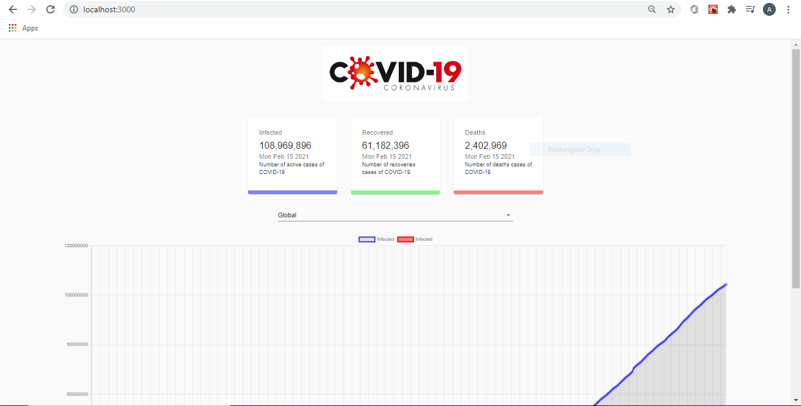

# COVID-19-Tracker
This is a web application that tracks the number of COVID-19 cases globally and based on a country. It uses real-time data fetched from MATHDROID API, that has COVID-19 stats and data.

## Screenshot

## Languages and Technologies
REACT, NODE , HTML, CSS , MATHDROID API, MATERIAL UI
## Before Using
* Nodejs is installed (https://nodejs.org/)

## Create React App
* npx create-react-app covid-tracker

## Install Dependencies
* npm install 
* npm install axios react-chartjs-2 react-countup classnames chart.js @material-ui/core

## Usage
To run the project, please use the following command:
* npm start
  * It will run the server at port 3000.

## Setup Firebase Hosting
* Go online setup firebase hosting then run
    * npm install -g firebase-tools

## Deployment
Run the following commands:
* firebase login
* firebase init
* npm run build
* firebase deploy

### Live 
[Covid Tracker](https://covid-tracker-5fc43.web.app/)
